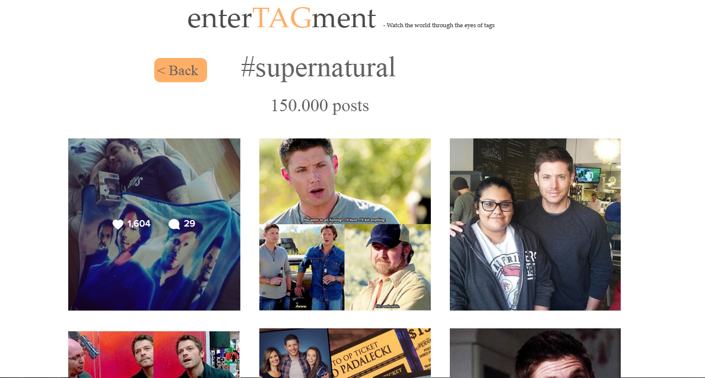

# 1dv449_jsigc09
Webbteknik ||

#Projektbeskrivning

Mitt projekt kommer att gå ut på att presentera statistik för mina top fem taggar inom fandoms från Instagram. Målet är att kunna presentera statistik för senaste 24 timmarna för att hålla koll på om något
nytt hänt i fandom-världen (t.ex. nytt avsnitt har släppts) men även statistik för senaste 3 månaderna.

Man ska då även kunna klicka på en viss tagg och få upp en snygg sida med de senaste bilderna från Instagram med den här taggen.

Det här projektet går att utveckla i all oändlighet för mig så om tid finns kommer jag försöka kolla taggarna mot Twitter också för att sammanställa statistik därifrån även. Dessutom skulle det gå att få till att användaren själv
får välja vilka taggar hen vill sammanställa information om.
Men grundkonceptet är alltså att arbeta mot [Instagrams API](https://www.instagram.com/developer/) vilket jag aldrig har gjort tidigare samt [Google charts API](https://developers.google.com/chart/) för att få fram snygga diagram
 över den sammanställda informationen.
