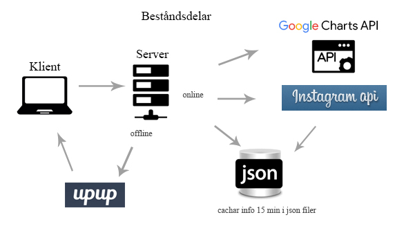

# Rapport
Julia Sivartsson, jsigc09

Projekt 1dv449 Webbteknik ||

##Inledning 
Som projekt har jag valt att skapa en applikation för att visa upp information ifrån Instagram. Då jag personligen är en stor nörd när det kommer till tv-serier och filmer så valde jag att just det skulle vara temat för applikation. Namnet enterTAGment kom sig av att det är information om taggar som jag plockar ut ifrån instagram och entertainment är ju innehållet.

En exakt likadan applikation har jag inte sett tidigare men det finns många som använder sig av Instagrams API där ute på olika sätt. Anledningen till att jag valde att bygga en sådan här applikation är främst för personligt bruk. Jag vill kunna hålla koll på de serier och filmer som jag själv följer och se om ny information dyker upp på Instagram.

##Tekniker
 
###APIer
**Google Charts API**
För att visa upp statistiken har jag valt att använda mig av Google Charts API. Det fungerar väldigt bra, fast det tog en hel del tid att hitta hur jag skulle få in två diagram på samma sida samt hur jag fick texten länkbar.
 
**Instagram API**
Jag valde att hämta information ifrån Instagrams API. Detta för att jag gillar deras applikation och det kändes som en rolig uppgift att få det att fungera då jag inte hade någon erfarenhet av det api:et.
 
###Språk
Förutom API:erna har jag använt mig av **JavaScript** och **PHP**. PHP därför att det är det språk jag är mest bekväm med så för att balansera min okunskap i JavaScript så var det skönt att ha något som jag kände mig lite hemma i. JavaScript är ett fantastiskt verktyg med så många möjligheter men det tog lite tid för mig att komma in i det igen då jag inte använt det på länge så kodstrukturen är inte optimal.
 
##Schematisk bild

##Säkerhet
Jag har valt att göra en enkel applikation som inte har inloggning (i alla fall inte i nuläget) så försvinner risker med CSRF-attacker och jag använder heller ingen databas vilket tar bort många säkerhetsaspekter så som SQL-injections. Jag har kollat en del på OWASP TOP 10 för att se om det är något jag kunde anpassa mig efter.

##Prestandaoptimering

**Cachning**
Jag har valt att cacha informationen från Instagram i 15 minuter. Det är inte superviktig information i sig så 15 minuter kändes rimligt att spara informationen.
Man skulle kunna höja cachningstiden ännu mer för att undvika ytterligare requests men jag ville hålla informationen någorlunda ny.

**Placering av filer**
* Stylesheets så som CSS är placerade inom HEAD-taggen för snabbare inläsning.
* JavaScript-filer är placerade precis innan avslutande BODY-tagg för snabbare inläsning av sidan.

**Minifiering**

JS- och CSS-filer som används är minifierade för att minska belastningen på applikationen.

**CDN**

Jag ville använt mig av CDN för font-awesome, jQuery och bootstrap men det uppstod ett flertal fel som jag inte lyckades lösa så jag valde att lägga dem på servern istället, det kanske belastar lite mer men jag hann inte hitta en lösning på problemet tyvärr.

##Offline-first
Begreppet offline-first var helt nytt för mig innan den här kursen och jag kände mig väldigt vilsen hur jag skulle implementera det. Men efter mycket sökande så hittade jag först [Offline](http://github.hubspot.com/offline/), som jag enkelt kunde koppla till min applikation med hjälp av [Eager](https://eager.io/). Därefter satte jag in ett JS-script på min HTML sida som kollar var femte sekund om klienten har internet uppkoppling. Det fungerar väldigt bra och känns oerhört användbart.

Men jag kände att jag ville utforska det här området mer och hittade då [UpUp](https://www.talater.com/upup/). Men för att använda sig av UpUp behövde jag köra min applikation över HTTPS-protokoll så jag valde att skapa en webbplats hos [One.com](https://www.one.com/sv/) då de även erbjuder licenser för HTTPS.
Så när det var klart var det bara att köra igång och testa UpUp. Det är ett fruktansvärt smidigt bibliotek som gör att jag nu har en offline version av min applikation, även om det är en del jag ännu inte fått att fungera. Jag skulle vilja att den cachade alla JSON filer som ligger på min server men jag hittar ingen information ifall det går att göra det på något automatiskt sätt t.ex. genom att cacha alla filer som slutar på json (*.json), så för tillfället så hårdkodar jag in dem för cachning vilket gör att jag får string dependency vilket egentligen inte är så bra men jag hittar ingen bra lösning för det just nu.

Jag är dock nöjd med hur jag fick ihop min offline lösning tillslut, nu visar den upp en komplett sida där den cachade informationen visas och om bilder är cachade så visas även de.

##Risker med din applikation
Då jag som sagt varken använder mig av inloggning eller databas så försvinner många säkerhetsaspekter, likaså då jag i nuläget inte har några input-fält heller.
Det skulle vara ifall skadlig kod skickas in ifrån API:et då jag i nuläget inte filtrerar indata på något sätt.

Jag har dock valt, eftersom JavaScript är nödvändigt för att applikationen ska fungera som den ska, att användaren meddelas om JavaScript inte är aktiverat.
Dessutom meddelar jag användaren ifall data inte kunde hämtas från API:et och presenterar då istället gammal data.

Jag har försökt få med så mycket felhantering som möjligt och försökt testa de scenarion jag kommer på så gott det går.

##Egen reflektion kring projektet

Det här projektet har varit oerhört utmanande för mig då jag inte hade någon som helst erfarenhet utav API:er eller Offline-first innan den här kursen.
Jag tycker att jag har utmanat mig själv på en lagom nivå även om det är väldigt mycket jag skulle vilja ha hunnit arbeta vidare på innan projekttidens slut, men jag kommer arbeta vidare på det efteråt i vilket fall. Några av de sakerna är att de taggar man söker på ska vara individuellt, alltså att det finns input-fält så att användaren själv kan välja vad hen vill söka efter för fandom.
Jag ville även få in snyggare paginering av bilderna, där bilderna är centrerade om det är färre än fura, samt hur de visas i popup-fönstret. Det är lite designaspekter som jag inte lyckats åstadkomma helt.
Det skulle ju givetvis gå att få in inloggning också och på så sätt spara informationen baserat på användare, men det är inget jag hann med på den här tiden tyvärr.

Jag är inte helt nöjd med min JavaScript-kod heller. Jag känner inte att den är generell nog utan skulle behöva omstruktureras lite men jag ville få saker och ting att fungera i första hand, och det gör de nu.

Jag har stött på en hel del problem under projektets gång. Till en början var det för att få ihop så att anropen till Instagrams API fungerade som de skulle, därefter vilka anrop jag hade tillåtelse att göra. Vad jag insåg var att när man kopplar sin applikation till Instagrams API så hamnar man i Sandbox läge, vilket innebär att jag inte har tillåtelse att hämta andra användares bilder och visa upp, bara mina egna och de konton jag har kopplat till applikationen.
Jag kan däremot hämta information om hur mycket en tagg har använts, men inte bilderna där de är taggade alltså. Så jag har lagt upp lite testbilder på mina två Instagram konton för att testa applikationen. När jag känner mig helt nöjd med den kanske det får bli att ansöka om att komma ur Sandbox läget.

Även om väldigt mycket har krånglat för mig under projektet så känner jag mig nöjd över att jag faktiskt lyckades få ihop det här resultatet. Jag har lagt ner väldigt mycket tid på att få saker och ting att fungera och gjort allt jag kan för att resultatet faktiskt skulle bli ungefär så som jag satte upp i min vision.
